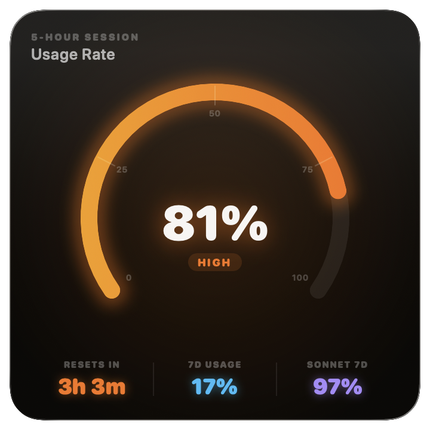
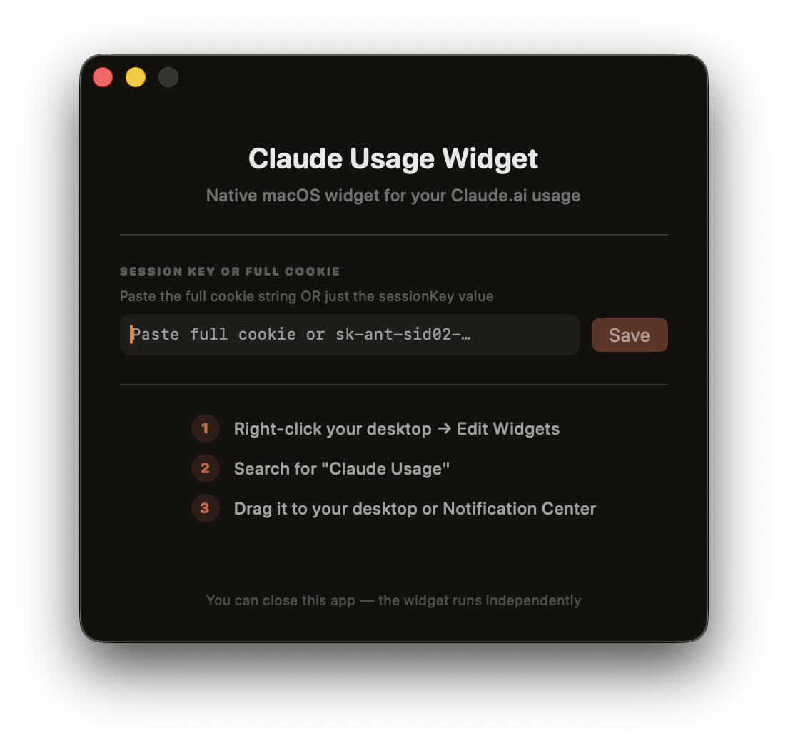
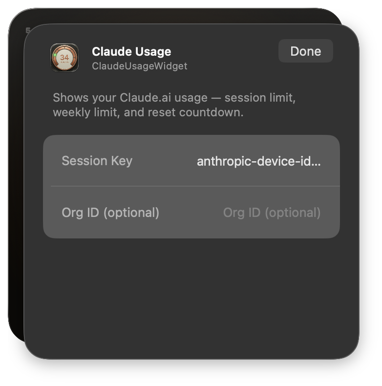

# Claude Usage Widget

A native macOS floating widget that shows your [Claude.ai](https://claude.ai) usage limits in real-time — right on your desktop or in Notification Center.

| Widget | Setup window | Widget config panel |
|:---:|:---:|:---:|
|  |  |  |
| Floating overlay — Neon Arc style | First-launch setup & credential entry | WidgetKit editor with session key config |

---

## Features

- **Live usage data** — 5-hour rolling window, 7-day limit, and Sonnet (Pro) quota
- **5 widget styles** — Orbital Rings, Command Center, Liquid Glass, Neon Arc, Timeline
- **Two auth methods** — Claude Code OAuth (zero-config) or manual session key
- **Smart auto-poll** — set a refresh interval (5 min, 15 min, custom) or leave it off and refresh on demand
- **macOS Notification Center** — installs as a standard WidgetKit widget via the Widget Gallery
- **Floating overlay mode** — pin to any Space, always on top
- **Notifications** — alerts at 75 % / 90 % / 95 % usage thresholds
- **Pull-to-refresh, double-tap, ⌘R** — multiple ways to trigger a manual refresh

---

## Requirements

| | |
|---|---|
| macOS | 14 Sonnet or later |
| Xcode | 15 or later |
| Claude account | Free or Pro |

---

## Installation

This project must be built from source — no pre-built binary is distributed.

### 1. Clone

```bash
git clone https://github.com/your-username/claude-usage-widget.git
cd claude-usage-widget
```

### 2. Configure your Team ID

The WidgetKit extension shares data with the host app via an **App Group**. You must update the group identifier to use your own Apple Developer Team ID.

Search for `YOUR_TEAM_ID` in the repo and replace every occurrence with your actual Team ID:

```bash
# Quick replace (substitute ABCD1234EF with your real Team ID)
grep -rl "YOUR_TEAM_ID" . | xargs sed -i '' 's/YOUR_TEAM_ID/ABCD1234EF/g'
```

Files affected:
```
ClaudeUsageWidget/ClaudeUsageWidgetApp.swift
ClaudeUsageWidget/AppDelegate.swift
ClaudeUsageWidget/ClaudeUsageWidget.entitlements
ClaudeUsageWidgetExtension/ClaudeUsageWidget.swift
ClaudeUsageWidgetExtension/ClaudeUsageWidgetExtension.entitlements
```

Your Team ID appears in Xcode → Signing & Capabilities, or at [developer.apple.com](https://developer.apple.com/account).

Also update the bundle IDs in Xcode's project settings if desired (e.g. `com.yourname.usagewidget`).

### 3. Build & deploy

The included `deploy.sh` script builds a Release binary, signs it with ad-hoc signing (no paid account needed), registers the WidgetKit extension, and launches the app:

```bash
chmod +x deploy.sh
./deploy.sh
```

After the script finishes:

1. Right-click your desktop → **Edit Widgets**
2. Search for **"Claude Usage"**
3. Drag it to your desktop or Notification Center

### 4. First run — add credentials

The app opens a setup window on first launch. Follow the instructions there.

---

## Authentication

The widget supports two auth methods, tried in priority order:

### Option A — Claude Code OAuth (recommended, zero setup)

If you have [Claude Code](https://claude.ai/code) installed, the widget reads your OAuth token from `~/.claude/.credentials.json` automatically. No manual steps needed — tokens are auto-refreshed by Claude Code.

### Option B — Session key

1. Open [claude.ai](https://claude.ai) in your browser
2. Open DevTools → **Application** → **Cookies** → `claude.ai`
3. Copy the value of the `sessionKey` cookie (starts with `sk-ant-sid02-…`)
4. Paste it into the widget's Setup window or Settings sheet

**Tip:** You can also paste the full raw cookie string — the app will extract `sessionKey` and `lastActiveOrg` automatically.

### Optional: `.env` file

Place a `~/.claude-usage/.env` file with your cookie values for convenience during development:

```
sessionKey=sk-ant-sid02-...
lastActiveOrg=xxxxxxxx-xxxx-xxxx-xxxx-xxxxxxxxxxxx
```

---

## Auto-Poll Interval

By default the widget is **manual-only** (click to update, no polling). This is intentional — the `sessionKey` cookie is long-lived and there's no reason to hammer the API constantly.

To enable automatic polling, open **Settings** (right-click the widget → Settings, or use the Setup window) and toggle on **Auto-Poll Interval**. Choose a preset (5 min, 15 min, 30 min, 1 hr) or type a custom number of minutes.

The setting persists across launches and updates both the floating widget and the WidgetKit extension timeline.

---

## Project structure

```
ClaudeUsageWidget/
├── AppDelegate.swift                  App lifecycle, window config, credential sync
├── ClaudeUsageWidgetApp.swift         @main, SetupView
├── Models/UsageModel.swift            UsageData, UsageWindow, UsageLevel
├── Services/
│   ├── APIService.swift               Claude API fetcher (OAuth + session key)
│   └── NotificationService.swift      Usage threshold notifications
└── Views/
    ├── WidgetView.swift               Floating widget wrapper + SettingsSheet
    ├── ShowcaseView.swift             5-style preview gallery
    ├── Components/
    │   ├── CircularGauge.swift        RingGauge, ArcGauge, UsageBar
    │   └── GlassCard.swift            Glass morphism, brand colors, WidgetBackground
    └── Styles/
        ├── Style1_OrbitalRings.swift
        ├── Style2_CommandCenter.swift
        ├── Style3_LiquidGlass.swift
        ├── Style4_NeonArc.swift       ← default widget style
        └── Style5_TimelineUsage.swift

ClaudeUsageWidgetExtension/
└── ClaudeUsageWidget.swift            WidgetKit timeline provider + all 5 widget views
```

---

## API used

This widget calls an **undocumented internal Anthropic API**:

```
GET https://claude.ai/api/organizations/{orgId}/usage
```

It is not part of any public API contract and may change without notice. The project will be updated when breaking changes are detected.

---

## Contributing

PRs welcome. If you add a new widget style, keep it in its own `StyleN_Name.swift` file and wire it up in both `ShowcaseView.swift` and `ClaudeUsageWidgetExtension/ClaudeUsageWidget.swift`.

---

## License

MIT — see [LICENSE](LICENSE).
